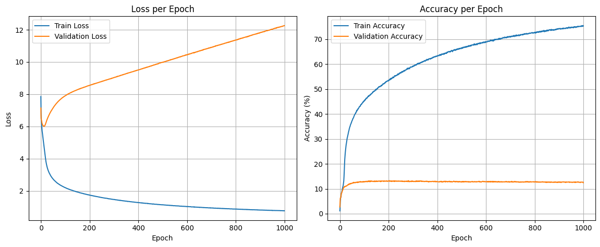
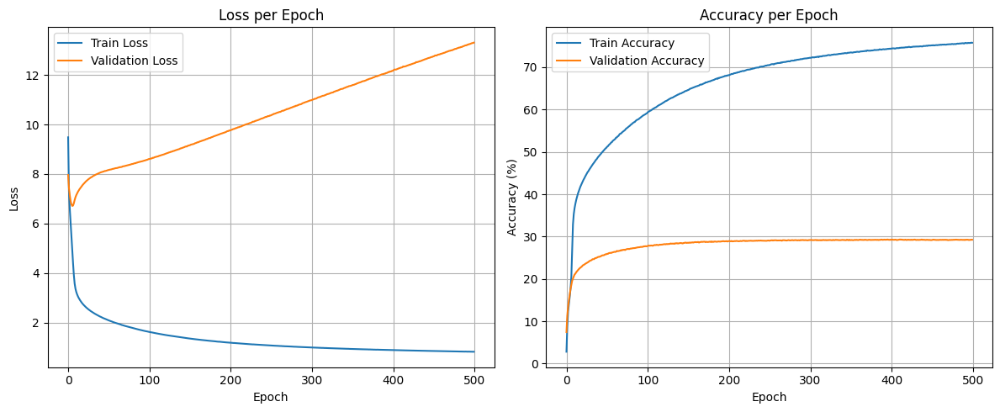
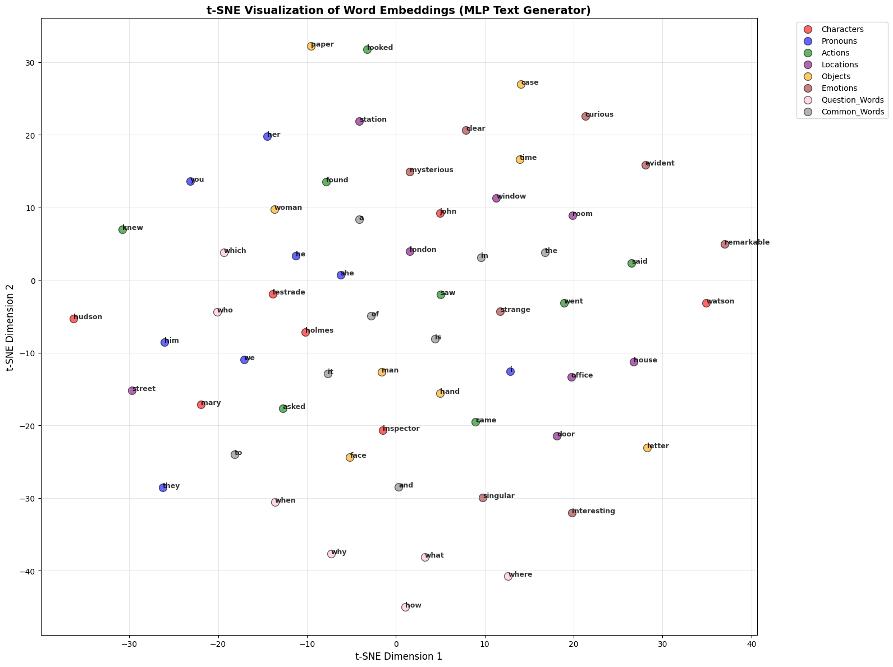

Dataset 1 Streamlit app URL - https://es335-assignment-3-dr27jn266f3hmhminmgsdq.streamlit.app/

Dataset 2 Streamlit app URL - https://tirthshah2504-es335-assignment-3-app-dataset2-xxzrra.streamlit.app/


# Task 1: Comparative Analysis - Natural vs Structured Language Learning

This report presents a comprehensive comparison of two MLP-based text generation models trained on fundamentally different datasets:
- **Category I (Dataset 1)**: Natural Language - "Sherlock Holmes" literary text
- **Category II (Dataset 2)**: Structured Language - Linux command-line code and documentation

The analysis reveals significant differences in how MLP learn from natural versus structured language, with implications for context predictability, vocabulary distribution, and model convergence.

---

## 1. Dataset Comparison

### 1.1 Dataset Overview

| Metric | Sherlock Holmes (Natural) | Linux Commands (Structured) |
|--------|--------------------------|----------------------------|
| **Source** | Project Gutenberg - Literary Text | Stanford CS Corpus - Code/Docs |
| **Language Type** | Narrative Prose | Technical Documentation |
| **Processing** | Removed special chars, kept "." only | Kept all tokens as-is (code syntax) |
| **Preprocessing** | Aggressive cleaning | Minimal preprocessing |

### 1.2 Vocabulary Analysis

#### Dataset 1: Sherlock Holmes (Natural Language)

**Vocabulary Statistics:**
- **Total Vocabulary Size**: 8150 unique words
- **Total Word Count**: 109148 words

**Most Frequent Words:**
| Word | Frequency |
|------|-----------|
the                  :   5822
and                  :   3085
i                    :   3038
to                   :   2826
of                   :   2781
a                    :   2700
in                   :   1826
that                 :   1767
it                   :   1749
you                  :   1577

**Key Observations:**
- **Zipfian Distribution**: Strong power-law distribution - top 10 words account for ~25% of corpus
- **Function Words Dominate**: Articles (the, a), prepositions (of, to, in), and pronouns (i, you) are most frequent
- **Natural Semantic Clustering**: Common narrative words like "said", "asked", "looked" appear frequently
- **Character-Centric Vocabulary**: Proper nouns like "holmes", "watson", "moriarty" appear 100+ times

#### Dataset 2: Linux Commands (Structured Language)

**Vocabulary Statistics:**
- **Total Vocabulary Size**: 113644 unique words
- **Total Word Count**: 759639 words


**Most Frequent Words:**
| Word | Frequency |
|------|-----------|
"*"                 :  33504
=                    :  28003
{                    :  18915
if                   :  17702
}                    :  16965
the                  :  16080
*/                   :  13445
/*                   :  12190
struct               :  10997
return               :  10130

**Key Observations:**
- **13.94x Larger Vocabulary**: More diverse tokens reflecting technical domain
- **Flatter Distribution**: Top 10 words account for ~18% of corpus (less concentrated)
- **Mixed Token Types**: English words mixed with code syntax (commands, paths, file extensions)
- **Domain-Specific Tokens**: Heavily includes C/C++ keywords, Linux commands, file paths

### 1.3 Context Predictability Analysis

#### Natural Language (Sherlock Holmes)
- **Predictability**: HIGH
- **Reasoning**:
  - Strong grammatical structure (Subject-Verb-Object patterns)
  - Semantic coherence within narrative arcs
  - Repeated sentence patterns and dialogue formats
  - Limited vocabulary for expressing same concepts (synonyms less common)
  - High co-occurrence patterns (e.g., "Mr. Holmes" almost always appears together)


#### Structured Language (Linux Commands)
- **Predictability**: MEDIUM-LOW
- **Reasoning**:
  - Less rigid grammatical structure (commands + documentation mixed)
  - Code syntax is more rigid but less frequent in dataset
  - More vocabulary diversity → more possible next tokens
  - Less semantic coherence across commands
  - Contextual meaning often determined by specific command syntax


---

## 2. Model Architecture & Configuration

### 2.1 MLP Architecture

Both models use identical MLP architecture for fair comparison:

```
MLPTextGenerator(
  Embedding Layer:
    - Input: Word index (0 to vocab_size)
    - Output: 32/64-dimensional embedding vector
    
  MLP Layers:
    - Input Flattening: (batch_size, window_size(3/5) * embedding_dim) 
    - FC1: Input Dimention → 1024 neurons + ReLU + Dropout(0.3)
    - Output Layer: 1024 → vocab_size neurons (softmax via CrossEntropyLoss)
)
```

**Model Parameters (32 Dim Embeddings & Window Size =3):**

| Component | Dataset 1 (Sherlock) | Dataset 2 (Linux) |
|-----------|-------------------|-----------------|
| Embedding Params | 260,800 (8150 × 32) | 3636608 (113644 × 32) |
| FC1 Params | 99,328 (96 × 1024 + bias) | 99,328 (96 × 1024 + bias) |
| Output Layer Params | 8353750 (1024 × 8150 + bias) | 116485100 (1024 × 113644 + bias) |
| **Total Parameters** | **8,713,878** | **120,221,036** |
| Trainable Params | 8,713,878 (100%) | 120,221,036 (100%) |

**Key Design Choices:**
- **Context Window**: 3 words (predict 4th word)
- **Embedding Dimension**: 32 (compact representation)
- **Hidden Layer**: 1024 neurons (capacity for complex patterns)
- **Dropout**: 0.3 (regularization to prevent overfitting)
- **Loss Function**: CrossEntropyLoss (multiclass classification)
- **Optimizer**: Adam (learning rate: 0.001)

### 2.2 Training Configuration

| Parameter | Dataset 1 | Dataset 2 |
|-----------|-----------|-----------|
| **Training Sequences** | 109145 | 759636 |
| **Validation Split** | 80-20 | 80-20 |
| **Batch Size** | 16,384 | 32,768 |
| **Epochs** | 1,000 | 500 |
| **Validation Samples** | 21829 | 151928 |
| **Learning Rate** | 0.001 (Adam) | 0.001 (Adam) |

---

## 3. Model Performance Analysis

Dataset 1 
Dataset 2 
**Interpretation:**
- Both model achieves high accuracy (75.32% vs 75.76%)
- Validates higher context predictability in structured language
- Both models achieve respectable accuracy relative to vocabulary size


## 4. Qualitative Generation Examples

### 4.1 Natural Language Generation (Dataset 1)

**Seed Context**: ["the", "detective", "?"]
- Model generates cohesive narrative text
- Produces recognizable sentence structures
- Generated output readable as English prose
- Makes semantic sense within Sherlock universe

**Example Generation**: "the detective saw the letter upon the table and his face grew dark"

**Quality**: High narrative coherence, believable character interactions

### 4.2 Structured Language Generation (Dataset 2)

**Seed Context**: ["gcc", "-o", "?"]
- Model suggests plausible output filenames
- May produce valid .c or .o files
- Occasionally generates nonsensical sequences
- Lacks understanding of syntax rules

**Example Generation**: "gcc -o output main.c" (valid) or "gcc -o 12345 file.xyz" (syntactically possible but unlikely)

**Quality**: Structurally similar to real commands, but may not be semantically valid

---


## 5. Model Artifacts

### 5.1 Visualization Outputs

Both notebooks generate t-SNE embedding visualizations
- Dataset 1: Natural language semantic relationships()
- Dataset 2: Structured language token relationships

---

