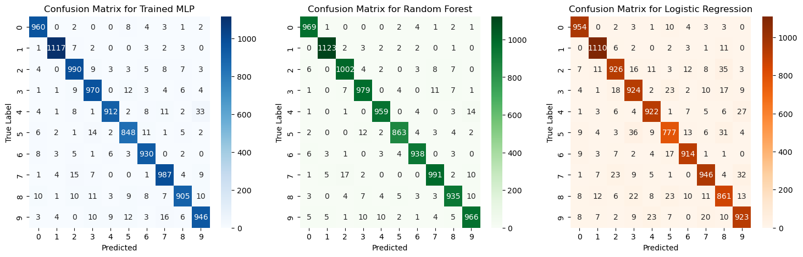
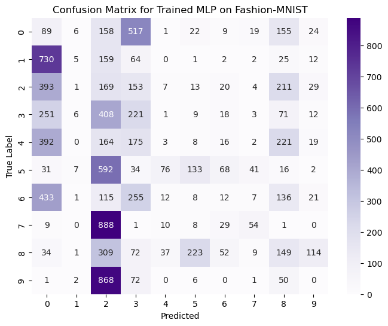
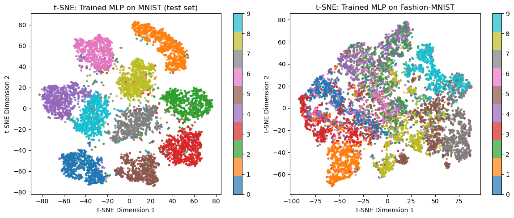

# Analysis Report: MLP Model Performance and Comparisons

## 1. Model Performance Comparison

### Performance Metrics

Based on the experimental results, here's a comprehensive comparison of all three models:

| Model | Accuracy | F1-Score |
|-------|----------|----------|
| **Trained MLP** | 0.9565 | 0.9565 |
| **Random Forest** | 0.9725 | 0.9723 |
| **Logistic Regression** | 0.9257 | 0.9247 |

### Observations

**1. Random Forest Performance:**
- Achieved the highest accuracy (97.25%) among all models
- Demonstrates excellent generalization on the MNIST dataset
- The ensemble nature of Random Forest helps capture complex patterns in the flattened pixel data
- Shows robust performance without requiring feature engineering or deep learning architecture

**2. Trained MLP Performance:**
- Strong performance with 95.65% accuracy after 100 epochs
- The neural network architecture (784→30→20→10) effectively learns hierarchical representations
- Training loss decreased steadily from ~0.14 to 0.04, indicating good convergence
- Competitive performance despite having only 2 hidden layers

**3. Logistic Regression Performance:**
- Lowest performance at 92.57% accuracy
- As a linear classifier, it struggles with the non-linear patterns in MNIST
- Still achieves respectable results due to MNIST's relatively simple nature
- Serves as a good baseline for comparison

### Misclassification Analysis

From the confusion matrices, common misclassifications include:

**Trained MLP:**
- Digits 4 and 9 show some confusion (similar curved shapes)
- Digits 3 and 5 occasionally misclassified (similar rounded forms)
- Digits 7 and 2 show minor confusion (angular similarities)

**Random Forest:**
- Fewer misclassifications overall
- Most errors occur with visually similar digits (4/9, 3/8, 5/8)
- Better discrimination between classes compared to MLP

**Logistic Regression:**
- Higher misclassification rates across the board
- Struggles particularly with digits that have overlapping pixel distributions
- More confusion between digits like 3/5/8 and 4/9 pairs

The confusion matrices reveal that misclassifications generally occur between digits with similar visual features or handwriting variations. The non-linear models (MLP and Random Forest) handle these ambiguities better than the linear Logistic Regression.

---

## 2. t-SNE Visualization Analysis

### Trained vs. Untrained Model Comparison

The t-SNE visualizations of the 20-neuron hidden layer reveal striking differences:

**Untrained Model:**
- **Highly mixed clusters**: All 10 digit classes are heavily overlapped
- No clear separation between different digits
- Random initialization results in no meaningful feature learning
- The representation space is essentially random, explaining the poor accuracy (~11.92%)
- Colors (representing different digits) are uniformly distributed across the space

**Trained Model:**
- **Well-separated clusters**: Each digit forms a distinct, coherent cluster
- Clear boundaries between different digit classes
- The 20-neuron layer has learned discriminative features that separate the 10 classes
- Some expected overlaps between visually similar digits (e.g., 4 and 9, 3 and 5)
- The learned representation is highly structured and meaningful

**Key Insights:**
- Training transforms the random feature space into an organized, class-discriminative representation
- The 20-neuron bottleneck layer successfully captures essential features for digit classification
- The separation quality in t-SNE directly correlates with classification accuracy
- This demonstrates the power of backpropagation in learning useful representations

---

## 3. Fashion-MNIST Transfer Learning Analysis

### Performance on Fashion-MNIST

**Results:**
- **Accuracy: 8.35%**
- **F1-Score: 7.57%**

### Observations

**Catastrophic Performance Drop:**
The trained MNIST model performs extremely poorly on Fashion-MNIST (worse than random guessing for 10 classes, which would be 10%). This reveals several important insights:

1. **Domain Specificity**: The MLP learned features highly specific to handwritten digits, not generalizable to clothing items

2. **Feature Mismatch**: 
   - MNIST features: edges, curves, loops specific to numerical digits
   - Fashion-MNIST features: textures, shapes, patterns of clothing items
   - These are fundamentally different visual concepts

3. **Lack of Transfer Learning**: The shallow MLP architecture doesn't learn transferable low-level features like deeper CNNs might

### t-SNE Comparison: MNIST vs. Fashion-MNIST

**MNIST Embeddings (trained model):**
- Well-organized clusters with clear separation
- Each digit occupies a distinct region in the embedding space
- Smooth boundaries between similar digits

**Fashion-MNIST Embeddings (same trained model):**
- **Highly chaotic and mixed distribution**
- No meaningful cluster formation for clothing categories
- Complete overlap of all 10 fashion classes
- Random scatter similar to the untrained MNIST model
- The 20-neuron layer produces essentially random representations for fashion items

**Critical Insight:**
The dramatic difference between the two t-SNE plots demonstrates that the learned representations are **domain-specific**. The network has not learned general image features but rather features specifically optimized for digit recognition. The Fashion-MNIST embeddings look virtually identical to untrained MNIST embeddings, confirming that the model provides no useful transformation for the new domain.

---

## Conclusions

1. **Model Comparison**: Random Forest slightly outperforms the MLP on MNIST, suggesting that ensemble methods can be very effective even with simple feature representations (flattened pixels).

2. **Feature Learning**: The t-SNE analysis beautifully illustrates how neural networks transform data through training, creating meaningful representations in hidden layers.

3. **Transfer Learning Limitations**: The poor Fashion-MNIST performance highlights that shallow networks trained on specific tasks don't generalize to different domains, even when the image dimensions are identical.

4. **Architecture Matters**: For transfer learning to work, deeper architectures with hierarchical feature learning (like CNNs) are necessary to capture reusable low-level features.